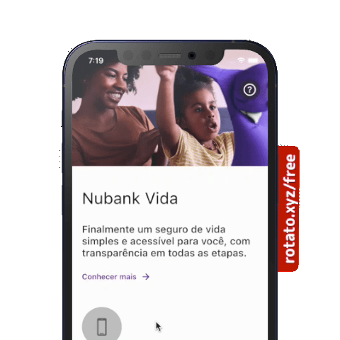

<h1 align=center> Seguros </h3>

  I was challenged to create an app with only the <a href="https://nubank.com.br" target="_blank">Nubank</a> life insurance part and fix some UI issues.

 

# Flutter

This is a <a href="https://flutter.dev/" target="_blank">Flutter</a> app, designed based on Nubank Vida.

 

# Solutions (or almost)

Changing the color of the statusbar when the image ends

  

 

Creating a pattern for navigation between modals

  

 

Creating patterns in the use of shadows

  
  
  

 

# Creators

Caio Moura

- <a href="https://github.com/caiomourasud" target="_blank">https://github.com/caiomourasud</a>
 
 

I hope you enjoy 🤘

